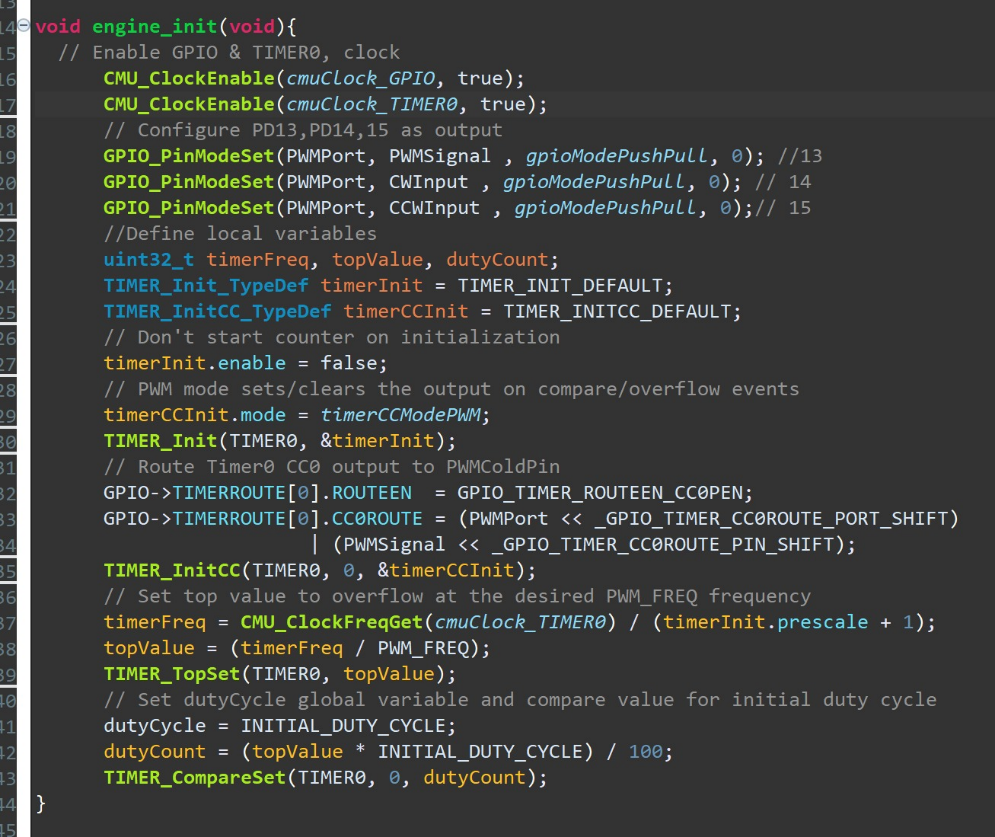
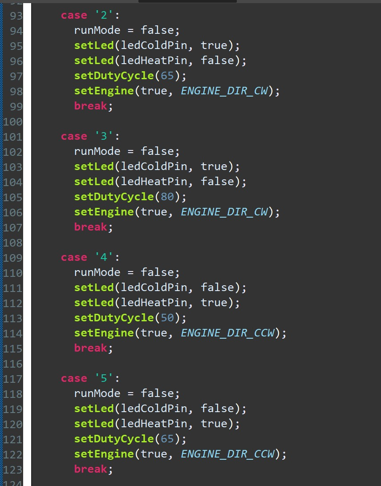
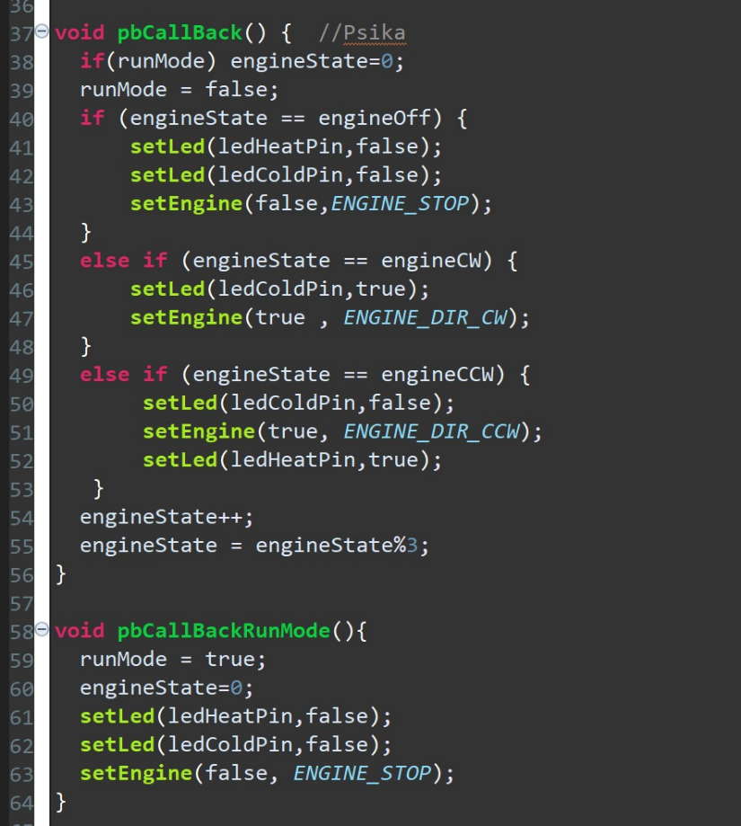
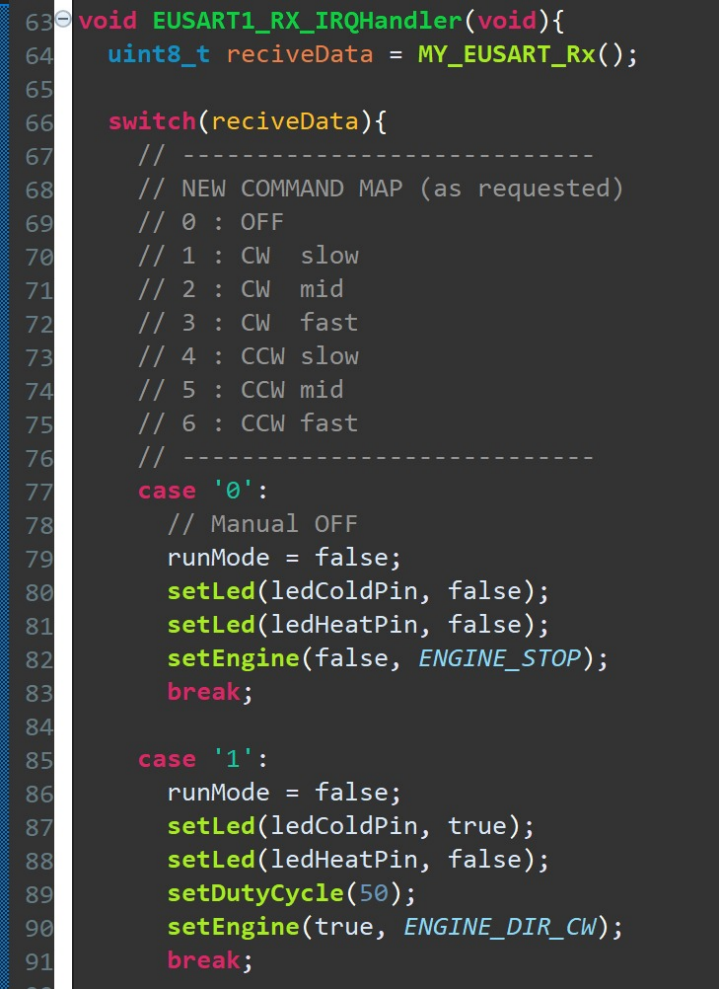
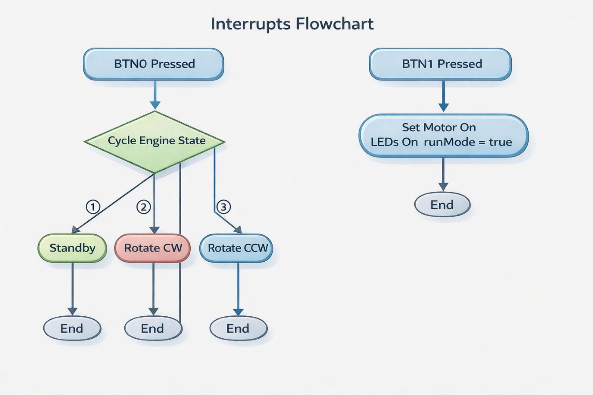

# ARM Cortex-M Temperature Control Unit

## Overview

Embedded temperature-control system using an ARM Cortex-M controller, digital temperature sensing, LCD feedback, PWM motor/fan control, Bluetooth commands, and interrupt-driven input.

## Technical Highlights

- ARM Cortex-M4 / EFM32WG control target.
- Si7021-style I2C temperature sensing.
- Automatic/manual operation modes.
- PWM motor/fan speed control.
- Bluetooth UART command interface.
- LCD and LED status feedback.

## Tech Stack

ARM Cortex-M, EFM32WG, C, I2C, PWM, UART, Bluetooth, Simplicity Studio

## Results

- System switches between heating, cooling, and standby based on measured temperature versus reference.
- PWM frequency calculation based on a 10 kHz timer and TOP=2000.
- Bluetooth interface supports mode, direction, speed, and reference-temperature commands.

## How to Run or Review

- Review the extracted C/H source files in `src/`; the raw Simplicity Studio archive is kept out of the public repo.
- Review extracted design screenshots in `assets/images`.

## Repository Notes

- This repository is prepared as a clean public GitHub portfolio version.
- Original course reports that contain student IDs or private details are not committed.
- The committed material focuses on source code, safe visuals, result screenshots, and a technical summary.

## Visuals

## Full Project Package

This repository now includes the complete public project package:

- `docs/full_report_redacted.md` - full technical report text with private identifiers removed.
- `assets/full_report_media/` or `assets/full_report_pages/` - report figures/pages where available.
- Project source/configuration folders where the original project included runnable code or design files.

Original raw report archives are not committed because they can contain private student metadata in covers, headers, or document properties.

## Public File Coverage

See `docs/public_file_coverage.md` for the complete list of public-safe project files included and the raw/private material intentionally excluded.
